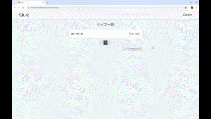
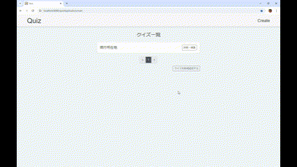

# WebQuiz

## ツール・ライブラリの名前
- Spring Boot
- Thymeleaf
- PostgreSQL

## 概要
このアプリケーションはSpring Bootで構築されており、ユーザーが4択クイズを作成・編集・解答できるWebアプリです。PostgreSQLデータベースを使用して、クイズデータを管理・保存します。

## 機能
- 問題の表示と回答の選択
- 自動で採点し、正答を表示
- 最終結果として正答数、正答率を表示
- 問題の追加、編集、削除

### デモ
- 問題が画面に表示され、ユーザーが選択肢から正しい答えを選ぶことができます。


- クイズ問題の内容や選択肢を編集することができます。編集後は、変更が即座に反映されます。



## 必要要件
- Java 17以上
- PostgreSQL 11以上

## 使い方
1. リポジトリをクローンする:
    ```
    $ git clone https://github.com/yoshikawa260/Quiz.git
    ```
2. PostgreSQLデータベースを準備。

    [SQL.txt を確認する](src/Common/SQL.txt)

3. アプリケーションを起動し、[http://localhost:8080/quizApplication/main](http://localhost:8080/quizApplication/main) にアクセスしてください。


## その他
このアプリケーションは、学習目的で作成されたものです。使用や改変は自由ですが、商用利用には注意が必要です。
